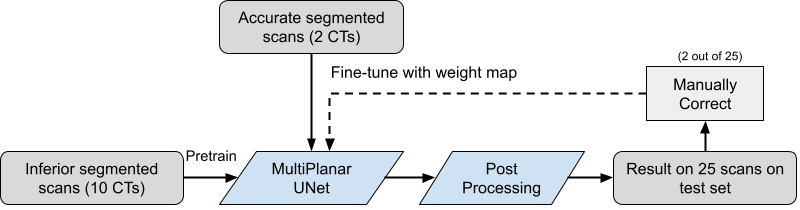
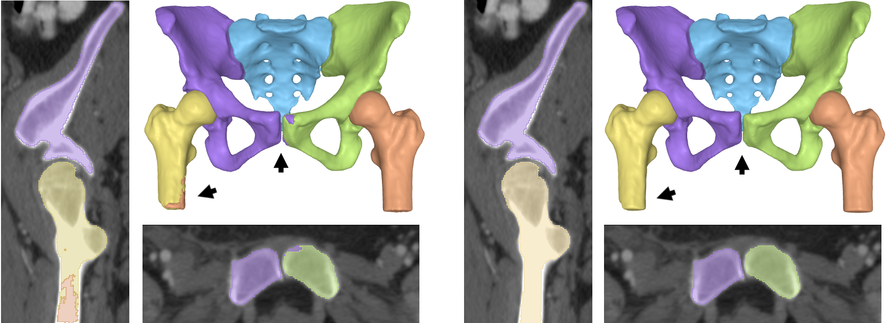
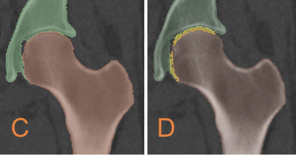

# Implementation of Paper Hip-Joints AutoSeg

Accepted in Medical Image Learning with Limited and Noisy Data (MICCAI Workshop)

Pre-print version: [https://arxiv.org/abs/2208.08226](https://arxiv.org/abs/2208.08226)

Published version: Waiting camera-ready, hopefully ready in Sepetmber

##  Multi-Planar U-Net
Most of the repository is based on the official implemenation of original Multi-Planar U-Net.
Please follow https://github.com/perslev/MultiPlanarUNet for the general installation and usage of Multi-Planar U-Net

Mathias Perslev, Erik Dam, Akshay Pai, and Christian Igel. One Network To 
Segment Them All: A General, Lightweight System for Accurate 3D Medical Image
Segmentation. In: Medical Image Computing and Computer Assisted Intervention 
(MICCAI), 2019
 
Pre-print version: [https://arxiv.org/abs/1911.01764](https://arxiv.org/abs/1911.01764)

Published version: [https://doi.org/10.1007/978-3-030-32245-8_4](https://doi.org/10.1007/978-3-030-32245-8_4)#

## Installation
Make sure you clone from this repository, and then run the following for installation.

```
pip install -e MultiPlanarUNet
```

---

##  Hip-Joints Specific Pipeline with Transfer and Interative learning
Here we present the pipeline mentioned in our paper.



### Initializing two projects, one for pretraining in public data, and one for fine-tuning as follows:

```
# Initialize a project for pretraining
mp init_project --name my_pretraining_project --data_dir ./pretraining_data_folder
# Initialize a project for pretraining
mp init_project --name my_finetune_project --data_dir ./finetune_data_folder
```

The YAML file named ```train_hparams.yaml```, which stores all hyperparameters will also be 
created for the two projects respectively. Any 
parameter in this file may be specified manually, but can all be set 
automatically. Please follow original MPUNet for the data format


### Pretraining
The model can now be pretrained as follows:

```
cd my_pretraining_project
mp train --num_GPUs=1   # Any number of GPUs (or 0)
```

### Fine-tuning
The standard fine-tuning process without disatance weight map can be applied by invoking 
```
# make sure you are at root dir
cd my_finetune_project
mp train --num_GPUs=1 --overwrite --transfer_last_layer --force_GPU=0 \
--initialize_from '../my_pretraining_project/model/@epoch_xxx_val_dice_xxxx.h5'
```
Make sure you change ```xxx``` according to the .h5 file generated from pretraining step 

### Fine-tuning with weight_map loss
To fine-tune with the weight_map loss, make sure you first compute the weight_map based on the labels of 
your training data. You can compute and store them by invoking the following command, where ```finetune_data_folder``` should be the root path to your fine-tuning dataset. You can also change the hyperparameters 
(std and erosion radius defined in the ```__main__``` function) 
```
python mpunet/preprocessing/weight_map.py finetune_data_folder
```

After the weight maps are stored on disk, you can fine-tune with weight_map loss by invoking
```
# make sure you are at root dir
cd my_finetune_project
mp train --num_GPUs=1 --overwrite --distance_loss --transfer_last_layer --force_GPU=0 \
--distance_map_folder weight_map_morph \
--initialize_from '../my_pretraining_project/model/@epoch_xxx_val_dice_xxxx.h5'
```
Make sure you change ```xxx``` according to the .h5 file generated from pretraining step 


### Interative Fine-tuning
To do Interative fine-tuning with the weight_map loss, make sure you first put the new training dataset to the data_dir, then modify the ```base_dir``` under the entry ```train_data``` in your ```train_hparams.yaml``` file.
then compute the weight_map based on the labels of 
your newly added training data. You can compute and store them by invoking the following command, where ```fineune_data_folder``` should be the root path to your newly added training data. You can also change the hyperparameters 
(std and erosion radius in the ```__main__``` function) 

```
python mpunet/preprocessing/weight_map.py fineune_data_folder
```

After the weight maps are stored on disk, you can fine-tune with weight_map loss by invoking the following, basically
remove ```--initialize_from``` and ```--transfer_last_layer```  tag and change ```--overwrite``` to ```--continue``` 

```
# make sure you are at root dir
cd my_finetune_project
mp train --num_GPUs=1 --continue --distance_loss --force_GPU=0 \
--distance_map_folder weight_maps 
```


### Predict
The trained model can now be evaluated on the testing data in 
```data_folder/test``` by invoking:

```
mp predict --num_GPUs=1 \
--force_GPU=0 \
--sum_fusion \
--overwrite \
--no_eval \
--by_radius \
--out_dir predictions 
```
note that the ```--sum_fusion``` tag is essential since we are not training 
another fusion model. ```--by_radius``` tage is also essential in ensuring different sampling strategy during training
and testing to avoid incomplete boundaries, as mentioned in the paper.

This will create a folder ```my_finetune_project/predictions``` storing the predicted 
images


### Post-Processing
The learnt rotational equivalence may cause problems for symmetric classes, this can be solved by the post-processing involving a symmetric CCD and morphologies by invoking:

```
python mpunet/postprocessing/symmetric_separtor.py predictions_path
```

predictions_path is the path to the model output after you run the previous ```mp predict ```

The parameter ```pairs``` should be a list of tuples where each tuple contains the class label of symmetric 
classes. In our case,  ```pairs=[(1, 2), (3, 4)] ``` represents (left femur, right femur), (left pelvis, right pelvis) respectively. The figure below shows the effect




### Evaluate to get DICE, GapDICE, and Hausdoff Distance, and ASSD
The post-processed results can now be evaluated on the testing data by running

```
python mpunet/evaluate/compute_metrics.py labels_path predictions_path
```
labels_path and predictions_path are the folder including the path to the label of your test data and path to the label to your model predictions (either with or without post_processing). 
This will print the mean and standard deviation for the 4 metrics, as well as generate a res.csv files where each row corresponds to the score for each image. You may then use simple a script or
Excel functions to get the mean and std of the overall performance

The GapDICE calculation will also store the generated gap region. Sample gap regions can be found in ```gap_regions_1```

### Collision Detection / Evaluate without ground truth 
To compute the regions corrsponding to Eq. 2 in the paper, run

```
python mpunet/postprocessing/active_weight_map.py predictions_path
```

predictions_path is the path to the model output (either with or without post_processing). This will create a new subfolder inside the ```predictions_path``` saving binary nifty images corresponding to the collision regions. This can be used as a guideline for (inter)active learning. It will also compute the total average area of such region. This can be a metric for model performance without ground truth (the smaller the better). 




# Final Finite Element Model

Much of the motivation of this project is under a larger project: LibHip - A Hip Joint Finite Element Model Repository available at https://github.com/diku-dk/libhip

The auto segmentation of hip joints is the essential first step to generate patient-specific hip joint finite element model for simulation studies. The generated surface mesh via marching cubes algorithm over the auto segmentation results is under the folder ```RawSegment```. The cleaning and remeshing can be applied automatically following the instruction. These operations are necessary to remove too dense or irregular triangles, which is usually due to the artefacts from marching cubes rather than segmentation qualities. The cleaned surface mesh from ```RawSegment``` is under ```CleanSegment``` folder in .obj format. Please refer to the ```CartiGen``` and later folders for the generated cartilage and the simulation results on it.

[](https://github.com/diku-dk/libhip)
